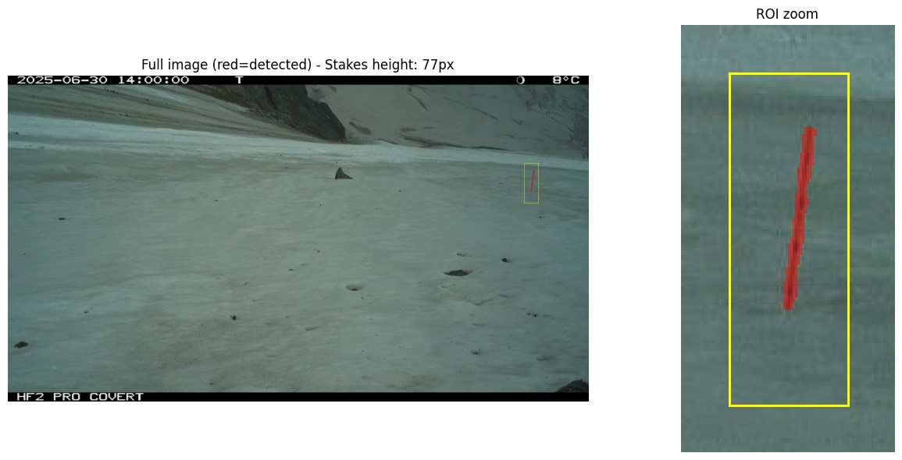

# Tutorial: detect a stake

In this tutorial you run the detection on two photos that come with the repository,
look at what was detected, and read the result file. It takes about ten minutes.

## Get the code

You need Python 3.12 or later and [uv](https://docs.astral.sh/uv/#installation).

```bash
git clone https://github.com/glacioraide/staketracker.git
cd staketracker
uv sync
source .venv/bin/activate
```

## Run the detection

The folder `tests/data/linceul_20250401-20251010` holds two photos of the Linceul glacier,
taken in May and June 2025. Run:

```bash
python scripts/detect_stakes.py \
    --input-dir tests/data/linceul_20250401-20251010 \
    --roi 1820 310 50 140 \
    --threshold 140 \
    --output tutorial \
    --save-annotated
```

`--roi` is the rectangle where the stake is: x and y of the top-left corner, then width and height,
in pixels. The search is limited to this rectangle. `--threshold` sets how strong an edge must be
to count as stake.

The script prints one line per photo:

```text
  RCNX2325.JPG: 77 px  (403 detected pixels)
  RCNX1995.JPG: 54 px  (280 detected pixels)
```

## Look at the result

Open `tutorial/annotated/RCNX2325_detected.png`:



The yellow rectangle is the ROI. The red pixels are what the detection kept: the stake.
Its visible height is 77 pixels.

Always check a few of these images when you process a new set of photos. They show
at a glance if the ROI or the threshold is wrong.

## Read the result file

`tutorial/detection_results.csv` has one row per photo:

```text
# staketracker_version: ...
# generated_at: ...
# input_dir: .../tests/data/linceul_20250401-20251010
# roi: (1820, 310, 50, 140)
# detection_params: {'wx': 0.9, 'threshold': 140.0, 'ksize': 1, 'clahe_clip': 1.0, 'clahe_tile': 2}
image,detected_pixels,balise_height_px,y_min,y_max,creation_date
RCNX1995.JPG,280,54,330,383,2025-05-28 14:00:00
RCNX2325.JPG,403,77,333,409,2025-06-30 14:00:00
```

The lines starting with `#` record how the file was made. `balise_height_px` is the
visible stake height, and `creation_date` is read from the photo's EXIF data.

The stake grew from 54 to 77 pixels between May and June: the snow around it melted.

## Next steps

- [Choose the ROI and threshold](how-to/roi-threshold.md) for your own camera.
- [Compute the snow level](how-to/snow-level.md) from a season of photos.
